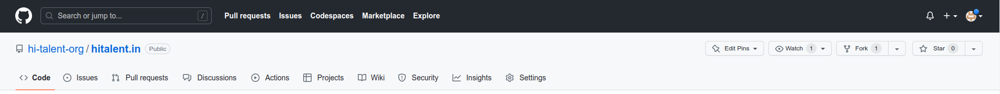
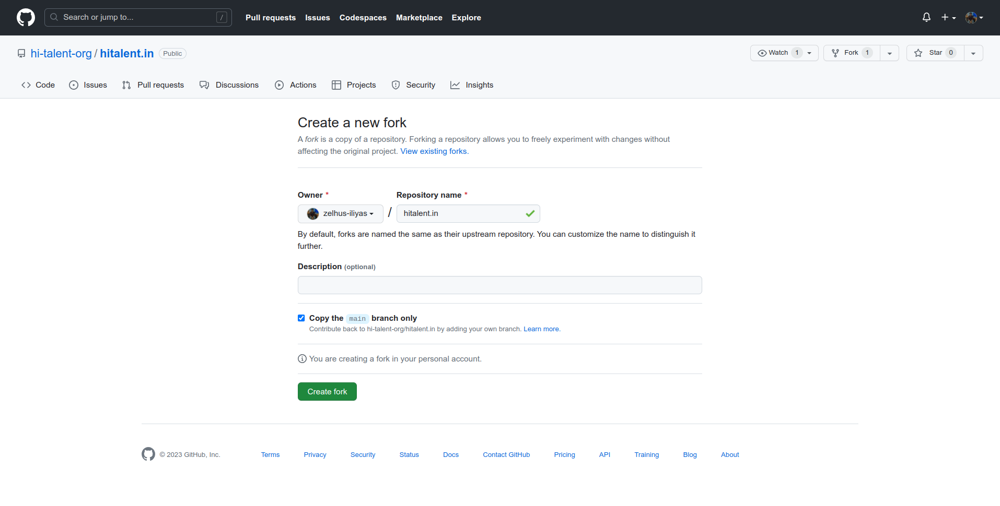
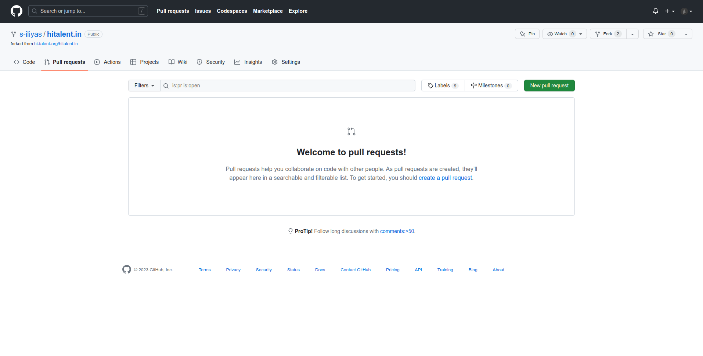
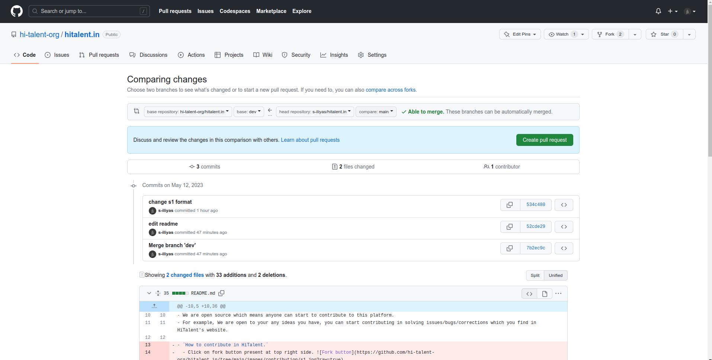
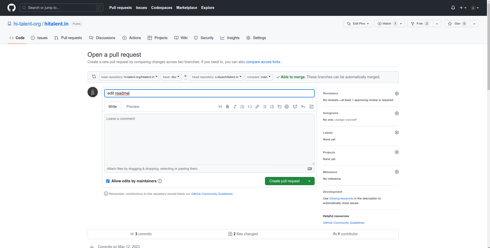

# HiTalent

## [Visit Website](https://hitalent.in)

- About:
  - We provide mentorship to individuals who aspire to become web developers.

## Open Source

- We are open source which means anyone can start to contribute to this platform.
- For example, We are open to your any ideas you have, you can start contributing in solving issues/bugs/corrections which you find in HiTalent's website.

### `How to contribute in HiTalent.`

1. Click on fork button present at top right side.

2. Choose owner (It's You) and then click create fork.

3. Once forking is completed, clone the forked repository in your local and then you can start solving bugs/errors/corrections/issues or can implement new ideas.

4. After changes made, push them to your respective forked github repository.

5. Create a pull request to dev branch of original repository(hitalent.in),keep in mind pull request should be to dev branch not other branches because it can cause deployment errors/merge conflicts/server downs.

6. Now go to your forked hitalent.in repository in your Github account, Click on pull request then click new pull request.

7. Check changes in all files which you made and then click create pull request but make sure you are creating pull request to dev branch of original hitalent.in repository from your forked repository which you can see above create pull request button beside where it shows able to merge.

8. After clicking create pull request, then give a title to pull request(for example, you can specify what changes you have done in one line.) and then click again create pull request and then wait till your code is reviewed by contributors. That's it, you have successfully contributed to our project and in open source.

### Thanks For Contributing...

## Follow us on [LinkedIn](https://www.linkedin.com/company/hitalent-in/)